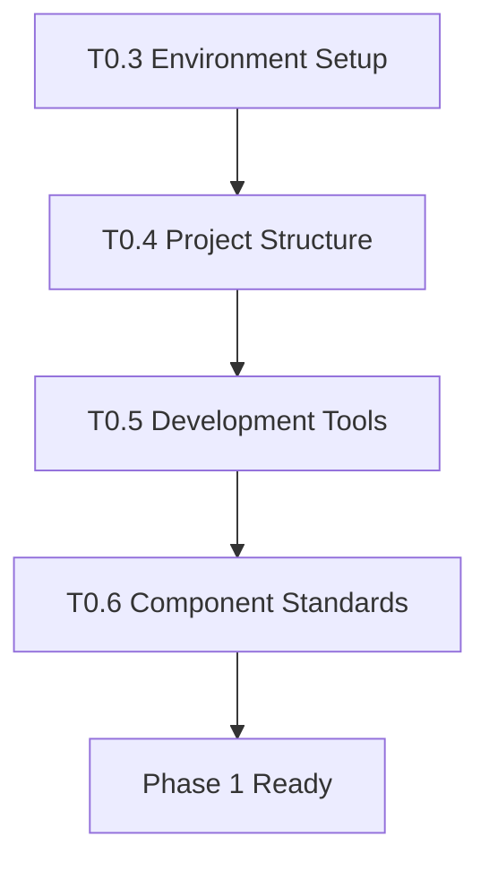

# Implementation Tasks: ERPindo ERP System

**Project**: Multi-tenant SaaS ERP System  
**Current Phase**: ✅ Phase 0 Complete - Ready for Phase 1  
**Updated**: October 12, 2025

## 🎯 Phase 0: Pre-Requisites (Setup & Validation)

**Goal**: Pastikan semua environment dan tools siap sebelum development dimulai.

### Task Breakdown

#### ✅ Completed Tasks

**T0.1 - Project Architecture Design**

- [x] Feature specification completed (`spec.md`)
- [x] Technical research and decisions documented (`research.md`)
- [x] Data model with RLS policies defined (`data-model.md`)
- [x] API contracts specified (`contracts/api-spec.yaml`)
- [x] Development quickstart guide created (`quickstart.md`)

**T0.2 - Constitution and Principles Verification**

- [x] Clean Code, DRY, KISS, SOLID principles documented
- [x] YAGNI and Separation of Concerns enforced in architecture
- [x] Multi-tenant data isolation strategy confirmed
- [x] Component reusability patterns established

#### ✅ Completed Tasks (Continued)

**T0.3 - Environment Setup**

- [x] **Verify Next.js project initialization**
  - Check `package.json` dependencies (Next.js 15.5.4, React 19+) ✅
  - Verify TypeScript configuration (`tsconfig.json`) ✅
  - Confirm Tailwind CSS setup (Tailwind CSS v4) ✅
- [x] **Setup Supabase Connection**
  - Configure `.env.local` with Supabase credentials ✅
  - Test MCP server connection to Supabase ✅
  - Verify database connection and basic queries ✅
- [x] **Initialize shadcn/ui Components**
  - Run `npx shadcn@latest init` ✅
  - Configure component directory structure ✅
  - Install core UI components (Button, Input, Card, Avatar, Dropdown, Sheet, Sidebar, etc.) ✅
  - Verify Lucide React icons integration ✅

**T0.4 - Project Structure Setup**

- [x] **Create Clean Folder Structure** ✅
  ```
  src/
  ├── components/          # Reusable UI components
  │   ├── ui/             # shadcn/ui components
  │   ├── auth/           # Authentication components
  │   ├── dashboard/      # Dashboard-specific components
  │   ├── modules/        # Module-specific components
  │   └── layout/         # Layout components
  ├── lib/                # Utilities and configurations
  │   ├── auth/           # Authentication utilities
  │   ├── supabase/       # Supabase client & queries
  │   └── permissions/    # Role & permission utilities
  ├── hooks/              # Custom React hooks
  ├── types/              # TypeScript definitions
  └── assets/             # Static assets
  ```
- [x] **Verify App Router Structure** ✅
  ```
  src/app/
  ├── (auth)/             # Authentication routes
  │   └── login/          # Login page
  ├── (dashboard)/        # Protected dashboard routes
  │   ├── dashboard/      # Main dashboard
  │   ├── system/         # System Owner modules (4)
  │   ├── company/        # Company Owner modules (3)
  │   └── erp/           # Staff ERP modules (10)
  ├── api/               # API routes
  ├── globals.css        # Global styles
  ├── layout.tsx         # Root layout
  └── page.tsx          # Landing page
  ```

**T0.5 - Development Tools Setup**

- [x] **Configure ESLint** ✅
  - Install and configure ESLint for Next.js + TypeScript ✅
  - Add custom rules for constitutional principles ✅
  - Configure import order and naming conventions ✅
- [x] **Setup Prettier** ✅
  - Install Prettier with Next.js compatibility ✅
  - Configure code formatting rules (.prettierrc) ✅
  - Setup VSCode integration ✅
- [x] **Git Hooks and Commit Conventions** ✅
  - Install husky for git hooks ✅
  - Setup lint-staged for pre-commit linting ✅
  - Configure conventional commit messages ✅
  - Add pre-push hooks for type checking ✅

**T0.6 - Component Standards Validation**

- [x] **shadcn/ui Component Directory** ✅
  - Verify consistent component installation ✅
  - Test component customization (neutral theme) ✅
  - Create component usage guidelines ✅
  - Setup component documentation patterns ✅
- [x] **Naming Convention Consistency** ✅
  - Establish file and folder naming patterns ✅
  - Component naming standards (PascalCase) ✅
  - Hook naming standards (use-kebab-case) ✅
  - Utility function naming (camelCase) ✅

**T0.7 - Basic Type Definitions and Utilities**

- [x] **Core Type Definitions** ✅
  - Authentication types (`types/auth.ts`) ✅
  - Module types (`types/modules.ts`) ✅
  - Database types (`types/database.ts`) ✅
- [x] **Supabase Client Setup** ✅
  - Client-side Supabase client (`lib/supabase/client.ts`) ✅
  - Service role client for server operations ✅
- [x] **Application Constants** ✅
  - User roles, module categories, route paths ✅
  - Default modules data structure ✅
  - Environment configuration ✅

### Task Dependencies



### Acceptance Criteria

**✅ Phase 0 COMPLETE**:

- [x] All design and planning artifacts exist ✅
- [x] Development environment fully configured ✅
- [x] Supabase connection verified and working ✅
- [x] Project structure follows constitutional principles ✅
- [x] Code quality tools (ESLint, Prettier) active ✅
- [x] shadcn/ui components properly initialized ✅
- [x] All naming conventions documented and enforced ✅
- [x] Git workflow with hooks configured ✅
- [x] TypeScript compilation successful ✅
- [x] Next.js build process working ✅

### Next Phase Readiness

**Phase 1 Prerequisites**:

- Clean development environment
- Working Supabase connection
- Component library ready for use
- Code quality standards enforced
- Team development workflow established

**Estimated Timeline**: 2-3 days for complete Phase 0 setup

### Quality Checks

**Before Moving to Phase 1**:

1. Can create and run Next.js development server
2. Can connect to Supabase and execute basic queries
3. Can create shadcn/ui components with consistent styling
4. ESLint and Prettier run without errors
5. Git commits follow established conventions
6. All folder structures match specification
7. TypeScript compilation successful without errors

---

## 📋 Future Phase Planning

### Phase 1: Authentication & Role-Based Dashboard

- **Duration**: 1-2 weeks
- **Key Deliverables**: Login system, role-based routing, dashboard layouts
- **Dependencies**: Phase 0 completion

### Phase 2: Staff ERP Modules

- **Duration**: 4-6 weeks
- **Key Deliverables**: 10 ERP modules with CRUD functionality
- **Dependencies**: Phase 1 authentication system

### Phase 3: Owner ERP Modules

- **Duration**: 2-3 weeks
- **Key Deliverables**: 3 company management modules
- **Dependencies**: Phase 2 ERP foundation

### Phase 4: Dev ERP Modules

- **Duration**: 2-3 weeks
- **Key Deliverables**: 4 system management modules
- **Dependencies**: Complete multi-tenant architecture

**Total Estimated Timeline**: 10-15 weeks for complete ERPindo system
